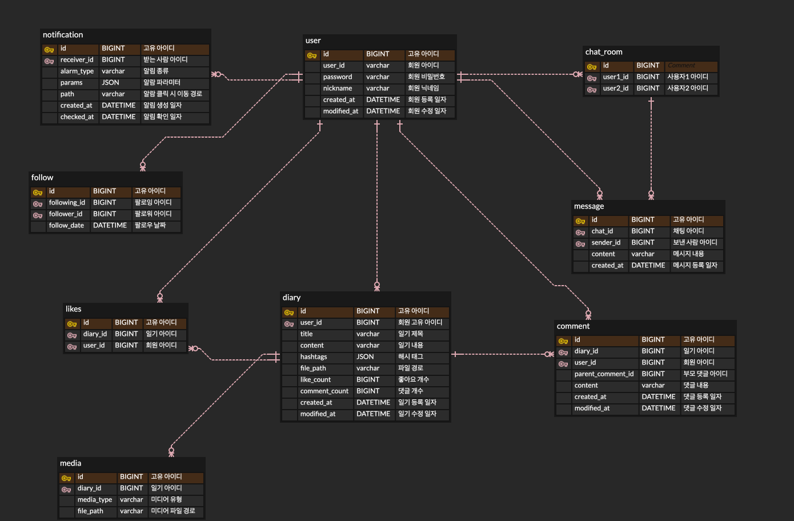

# 여행 일기 공유 서비스

여행 일기를 공유하는 SNS 서비스 개발 프로젝트 (11.13 ~ 12.15)

## 프로젝트 기능 및 설계

### 상단에 작성된 기능 부터 구현을 완료한다.

- 회원 가입 기능
  - 사용자는 회원가입을 할 수 있으며 일반적으로 모든 사용자는 회원가입시 USER 권한을 가진다.
  - 회원 가입시 아이디, 비밀번호, 닉네임을 입력받으며 아이디와 닉네임은 unique 해야한다.
- 로그인 기능
  - 사용자는 로그인을 할 수 있으며, 로그인 시 회원가입 때 사용한 아이디와 패스워드가 일치해야 한다.
  - Sping Security와 JWT 토큰을 사용해 인증 및 인가를 하도록 한다.
  - 서비스에서 제공하는 모든 기능은 로그인이 된 사용자만 이용할 수 있도록 한다.
- 회원 정보 수정 기능
  - 본인의 계정이 아닌 계정 정보를 수정할 수 없다.
  - 닉네임, 비밀번호를 수정할 수 있도록 한다.
- 회원 탈퇴 기능
  - 본인의 계정이 아닌 계정을 탈퇴할 수 없다.
  - 회원 정보를 삭제한다.
- 회원 follow 기능
  - 다른 사용자를 팔로우하여 팔로우 한 사용자의 일기에 대한 접근이 더 쉬워지도록 한다.
- following, follower 수 확인 기능
  - 사용자의 follower 수와 following 수를 확인할 수 있도록 한다.
- following, follower 목록 확인 기능
  - 로그인 된 사용자의 follower와 following 목록을 볼 수 있도록 한다.
  - 목록에서는 사용자의 닉네임이 보여지도록 한다.
- 일기 작성 기능
  - AWS S3를 이용해 여행에서 찍은 사진 또는 동영상을 업로드 할 수 있도록 한다.
  - 또한 일기 작성 시 제목, 본문, 해시 태그를 입력해 작성할 수 있도록 한다.
  - 해시 태그는 인스타그램과 유사하게 사용자가 원하는 해시태그를 모두 작성할 수 있도록 한다.
- 일기 수정 기능
  - 본인의 일기가 아닌 글을 수정할 수 없다.
  - 사진 or 동영상, 제목, 본문, 해시 태그를 수정할 수 있다.
- 일기 삭제 기능
  - 본인의 일기가 아닌 글을 삭제할 수 없다.
  - 일기 정보를 삭제한다.
- 일기 목록 기능
  - 다른 사용자의 일기를 등록순(날짜순), 댓글순, 좋아요순으로 보여줄 수 있도록 한다.
  - 또한 로그인 한 사용자 본인의 일기도 등록순(날짜순), 댓글순, 좋아요순으로 볼 수 있도록 한다.
  - 일기 리스트는 일기 제목과, 작성자, 해시태그, 좋아요수, 댓글수, 작성일을 보여줄 수 있도록 한다.
- 일기 좋아요 기능
  - 사용자의 일기에 좋아요를 누를 수 있도록 한다.
  - 본인의 일기에도 좋아요를 누를 수 있으며 좋아요를 누른 사람들의 목록도 확인할 수 있다.
- 일기 검색 기능
  - Elastic Search를 사용해 일기 제목, 작성자 닉네임, 해시 태그를 통해 일기 검색이 가능하도록 한다.
  - 제목을 통한 검색은 검색어를 포함한 일기들을 리스트로 보여준다.
  - 닉네임, 해시 태그를 통한 검색은 검색어와 정확히 일치하는 일기들을 리스트로 보여준다.
- 댓글 기능
  - 사용자의 일기에 댓글을 달 수 있도록 한다.
- 채팅 기능
  - WebSocket을 사용한 다른 사용자와 1:1 채팅이 가능하도록 한다.
- 알람 기능
  - Server Sent Event를 사용해 1:1 채팅이 왔을 때 / 일기에 댓글, 좋아요가 달렸을 때 사용자에게 알람이 가도록 한다.
- 추후 생각해볼 기능
  - 댓글이나 좋아요를 누를 때 동시성 문제를 어떻게 해결하지?
  - SNS 서비스의 특성상 대용량 트래픽일때 발생할 수 있는 문제를 어떻게 해결하지?
## ERD

## Trouble Shooting
[go to the trouble shooting](./doc/TROUBLE_SHOOTING.md)

## Tech Stack

   
  
  
  
  
  
  
  

